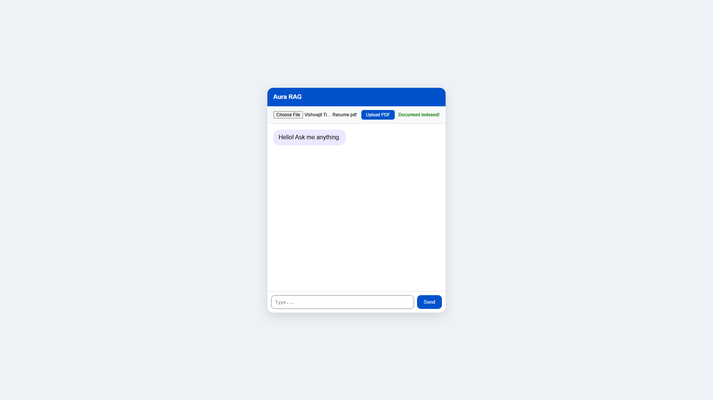
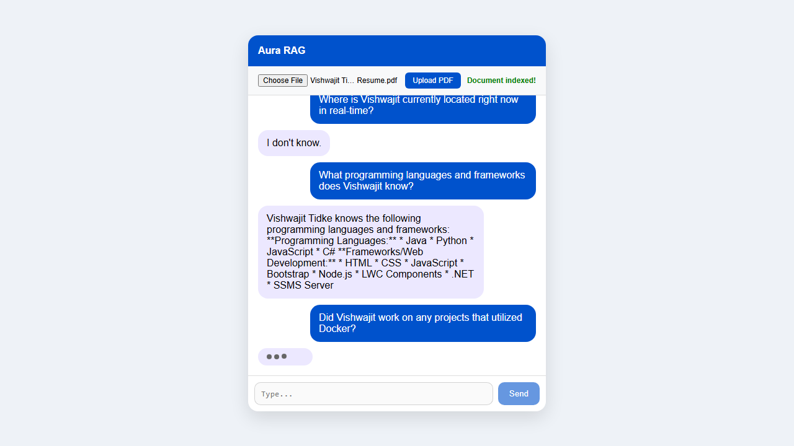

# Aura RAG Assistant

A fast, lightweight Retrieval-Augmented Generation (RAG) chatbot built with **FastAPI**, **LangChain**, **ChromaDB**, and the **Google Gemini API**.

## Features

- **Document Processing**: Upload PDFs to instantly extract and chunk text.
- **Local Vector Database**: Semantic embeddings are stored locally using ChromaDB.
- **Context-Aware Responses**: Connects to the Gemini LLM for precise, hallucination-free answers grounded in your specific documents.
- **Async & Real-time**: Fully asynchronous backend and vanilla JS frontend.

## Quick Start

### 1. Install Dependencies
```bash
pip install -r requirements.txt
```

### 2. Configure Environment Variables
Create a `.env` file in the root directory and add your Google Gemini API Key:
```env
GEMINI_API_KEY=your_api_key_here
```

### 3. Run the Server
```bash
python app.py
```
*The application will be available at `http://127.0.0.1:8000`*

## Demo Video

https://github.com/vishwajittidke/RAG-Bot/blob/master/demo_video.mp4

## Screenshots

### Main Interface


### Live Chatting

